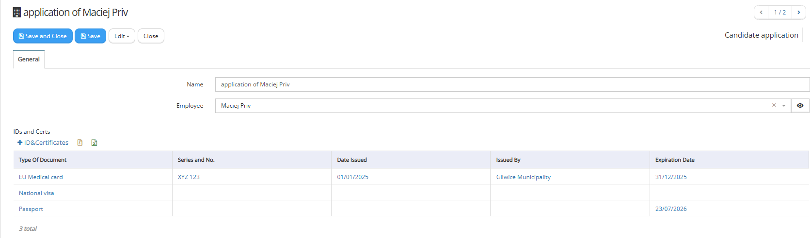
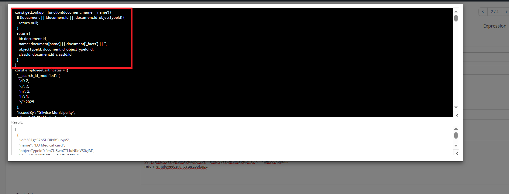

# Methods


### Get current user roles

```
#{getRoles}
const roles = getRoles();
```

### Get current user Person

```
#{getPerson}
const person = getPerson();
```

### Get corporate currency

```
#{getCorporateCurrency}

const currencyId = getCorporateCurrency();
return currencyId;
```

### Get company settings

```
#{getCompanySettings}

const companySettings = getCompanySettings();
```
### Get last document

```javascript
const getLastDocument = #{getLastDocument({
  "key": "contractNo",
  "parentKeyInDocument": "changeContractId",
  "sortKey": "contractChangeNo",
  "keyOfViewAtMainDocument": "contractVersions",
  "isOrderDescending": true,
  "nthRecord": 0,
  "filters":{
    "status.id": "kH7nQsqQHjITKbz1vg9N, BNkm2KN8uzel29BbhC2r", 
    "_disabled": false
    }
   }
 )
}

const result = getLastDocument();
return result;
```

General description:

This method returns one record based on parameters from a hierarchy of related records. Uses cascade relation (latest amendment is related with previous amendment) as well at the same time direct relation to parent (all amendments are related with the main contract).


Function returns a lookup value of document that can be used in select or dropdown attributes.\
Algorithm: checks the document at "key", finds the main version of document by parentKeyInDocument, then collects all versions by top-to-bottom.\
If loop is detected (C01 -> C02 -> C03 -> C01), function breaks and returns nothing.

Fields:
<ul>
<li>key - REQUIRED - key to the lookup attribute that contains the document. This is the only key used in this collection as parameter which is appearing on the same form to which  belongs attribute that we are applying this method in it's expression;</li>
<li>parentKeyInDocument - REQUIRED - key to the parent document;</li>
<li>keyOfViewAtMainDocument - OPTIONAL (default: none) - includes versions from the view at main document. Helpful when main document and versions isn't on the same object type;</li>
<li>sortKey - OPTIONAL (default: none) - all documents will be sorted by the given key;</li>
<li>isOrderDescending - OPTIONAL (default: false) - changes sorting from ascending to descending;</li>
<li>nthRecord - OPTIONAL (default: 0) - returns nth value of versions list. If number bigger than value list, acts as 0.</li>
<li>filters - OPTIONAL (default: no filters) - pairs of attributes and values. Values can be multiple, separated by comma</li>
</ul>

Use case examples:
<ul>
<li>If newest contract version is needed - order by desc and return 0-th value.</li>
<li>If oldest contract version is needed - order by asc and return 0-th value.</li>
<li>if documents with specific status is needed, add filter ("status.id": "kH7nQsqQHjITKbz1vg9N")</li>
<li>if documents with specific statuses is needed, add filter ("status.id": "kH7nQsqQHjITKbz1vg9N, BNkm2KN8uzel29BbhC2r")</li>
</ul>

Root github item:&#x20;

[https://github.com/Vecticum/vecticum/issues/1786](https://github.com/Vecticum/vecticum/issues/1786)

Usage examples:

<details>
<summary>Example 1:</summary>

The above code example is implementation of value expression for 'Select' type attribute 'Valid contract' placed on the invoice form which takes another 'Select' type attribute (key: contractNo) as parameter. In 'Valid contract' is automatically resolved latest valid contract on the basis of appointed Contract (in key: contractNo).&#x20;

By select type attribute changeContractId system is appointing on contract amendment form to which main contract amendment belongs to.

Attribute contractChangeNo is used on contract amendment form and is appointing amendment number to root contract.

We are using descending order because we would like to return first (0nth) value from top which means the amendment with the highest number.

In this example there is applied filter for 2 values of statuses with OR clause. Second part of the filter is to take contract which are not marked as disabled (boolean type key: \_disabled) .
</details>

<details>
<summary>Example 2:</summary>

This example illustrates resolving from organizational structure cluster department.&#x20;

Business case is:&#x20;

on the purchase form we need to have cluster manager for additional approval (to be used in workflow). As clusters are marked only top (2nd) level departments. We already have on purchase form select type attribute for department (key: department) which is filled in automatically as department of author:

&#x20;

<figure>.png)</figure>

This way appointed department should be started point for searching for 'cluster department'. In order to do so we will deploy select type attribute which will be appointing also department: 'Cluster Department'. It will be in read-only mode. It will have value expression deployed in the following way with the use of the 'Get last document' method:

```javascript
const getLastDocument = #{getLastDocument({
  "key": "department",
  "parentKeyInDocument": "parentId",
  "nthRecord": 0,
  "filters":{
    "level": "1"
    }
   }
 )
}

const result = getLastDocument();
return result;
```

&#x20;"key": "department" -  Attribute 'Department of initiator', with the key: department is used for delivering to the method parameter value; it appoints which attribute to consider while building up hierarchy of the records to be searched in.

"parentKeyInDocument": "parentId" - on the department form there is 'Parent department' lookup attribute to department. So we are appointing this one in order to investigate each other relation between departments.&#x20;

Form beginning: system takes the department appointed in key: department (in attribute 'Department of initiator') from the purchase form (in this example it is TEST DEP2) , then checks which department is assigned to it as parent by investigating the key: parentId:

&#x20;

<figure>.png)</figure>

The it keeps itterrating this manner, building the hierarchy. System also in the destination collection not only records from this direct chain but also the found leaves of the members of hierarchy.

Please notice that in this example we are omitting optional parameters:

```
 "sortKey" and "isOrderDescending"
```

We are doing it because: 1) there is not clear additional indication of additional attribute (like it was contract version number in Example 1) which will give some order of the objects. 2) we are expecting only single value to remain after applying the filter to all members of hierarchy. That is why first value we will would like to be returned: "nthRecord": 0&#x20;

Filter is applied to all members of hierarchy by the specific markup (text key: level) on department form:

<figure>.png)</figure>

&#x20;The relation in this case is presented like the following:

<figure>.png)</figure>

Please notice that in this case hierarchy will also consist of the other departments which are not illustrated above but which are related like parent to the presented members for example to 'Administration' or any other leaves.  In this example we are only marking Administration as cluster department with level === '1'. So that is why after applying filter single value is returned:

<figure>.png)</figure>

The last stage will be to deploy next select type attribute to person, in read only which will return in value expression, assigned manager to cluster department; the value expression of the new attribute will be: &#x20;

```javascript
return ${clusterDepartmentId.managerId};
```

where clusterDepartmentId is the key for attribute 'Cluster Department' (to which value expression we were using new, described in here method).

<figure>.png)</figure>

Conclusion is that for resolving only from direct chain of department relation without any additional markup (like level or any systematic numbering of departments) current method would be difficult to used. However with additional markup - like in above presented case - is very useful instrument. &#x20;

</details>

### Get value

Returns collection of the values depending on provided parameter. 

Example business case:
On cost allocation line form of the invoice, in 'Item' attribute, let user to pickup only the items which are chosen to collection of the valid contract lines. 'Valid contract' attribute is lookup type attribute to contract, is also deployed on cost allocation line of the invoice. In the case 'Valid contract' attribute is not filled in, let the user to pickup in 'Item' attribute any of the item from long dictionary list.

The following attribute is deployed on cost allocation line of the invoice:

<figure></figure>

In this attribute's 'Filter Expression' property we are using getValue method:

```javascript
#{getValue:validContract.contractItems.itemId.id}
if (!${validContract.id}){
    return true;
}
const itemIds = getValue();
return itemIds.includes($lookup{id})
```

 'Filter Expression' is applied for every record in destination items list; if returns true, such record is displayed in Item dropdown, if returns false, such one is not displayed in 'Item' dropdown.
Parameter of the method is:
 validContract.contractItems.itemId.id
where
validContract - is 'Select' type of attribute 'Valid contract', appointing Contract object type:

<figure></figure>

 On the form assigned to 'Development Contract', there is: contractItems attribute of 'Children' type:

<figure></figure>

On the form assigned to 'Contract Allocation' class (which represents lines of contract), there is attribute itemId, of 'Select' type to the same items list:

<figure></figure>

Finally we are appointing id as the key. 
So we can say that as the parameter of  the method is appointed technical id of the item picked in related contract line.  
Method returns collection of item ids. It is saved to constant:
```javascript
const itemIds = getValue();
```
Earlier we have the part which makes each item display on dropdown list in the case when no 'validContract' is picked:
```javascript
if (!${validContract.id}){
    return true;
}
```
  In the line:
```javascript
return itemIds.includes($lookup{id})
system checks if destination item id: $lookup{id}
```
is included in found itemIds collection. If yes returns true and such item is displayed on dropdown list. Otherwise it is skipped from display. 

### Get Performers From Category

**Introduction**

It is supposed to be used in value expression of multiselect type of attribute, which is appointing to 'Persons' like for example attribute: '1st level approvers' placed on 'Purchase invoice' form (key: firstLevelApproversPersons). 

<figure></figure>

The method returns collection of the persons. Resolved collection of persons can be used as dynamic responsible performer in workflow step.

<figure></figure>

On the same form ('Purchase Invoice'), where is placed the attribute ('1st level approvers', key: firstLevelApproversPersons) in which expression we are using the method, should be located another lookup (Select, Dropdown) attribute which is appointing category of the document. In our example case it is attribute 'Invoice Category' , key: invoiceCategoryId:

<figure></figure>

By default system is expecting the category will be appointed in attribute with the key: id_categoryId , however like in above case we can configure that category will be appointed by attribute with another key (for example: invoiceCategoryId). 

On this introduction stage it is important to know that for category we can assign in certain attribute (select or multiselect type) single or multiple process performers (or system process performers):

<figure></figure>

You can find process performers list in Setup->Process performers
Process performer can contain static definition of the members:

<figure></figure>

Or there are also predefined system performers with certain ids. When they are picked to the category, the method will be then resolving the persons in predefined manner. All the system performers will be described in below points.

**Definition of the method**

Example definition of value expression for the attribute '1st level approvers' placed on 'Purchase invoice' form (key: firstLevelApproversPersons): 

```javascript
#{getPerformersFromCategory(
    {
        "categoryKey": "invoiceCategoryId", 
	"performersKey": "firstLevelApprovers", 
        "lineManagersKeys": "id_createdBy",
      "workflowSchemePerformers": [
        {
          "processPerformerId":"5mtopSkFrlHsKM3KVTcW",
          "schemeKey":"leaveAccountant"
        },
        {
          "processPerformerId":"gS0vll6JH3pxSYPZsctA",
          "schemeKey":"invoiceAccountants"
        },
        {
          "processPerformerId":"wERAqLCZptOWGE3Gcp79",
          "schemeKey":"companyManagerId"
        }
      ],
    "extractPerformersFromKeys": [
      {
        "processPerformerId": "gS0vll6JH3pxSYPZsctA",
        "key":"counterparty.agentOne",
        "defaultSchemePerformerKey":"companyManagerId"
      },
     {
        "processPerformerId": "LYSDPYRVprfFcCdxQBU1",
        "key": "costAllocations.divisionManagerId"
      },
     {
        "processPerformerId": "z7ePgXruarMN70XitTRo",
        "key": "costAllocations.departmentManagerId"
      }
    ]
    }
)}
const result = getPerformersFromCategory();
return result;
```

**Algorithm and List of system performers**

System is checking if OPTIONAL key:

```javascript
"categoryKey"
```
is provided. If NO, then it will be finding category in the attribute with the key: id_categoryId (which is supposed to be Select type). Otherwise, like in our example case, it will be extracting category from provided key:
```javascript
"categoryKey": "invoiceCategoryId",
```
On category form, there can be stored multiple attributes appointing process performers. You need to setup from which attribute in category form system should extract process performers. In order to do this, you have deliver name of the key in category form by providing the following parameter:
```javascript
"performersKey": "firstLevelApprovers",
```
There is common area for storing categories used for different types of documents (except invoices) in Setup->Document Categories
For invoices categories: Setup->Invoice Categories 
On invoice category form (our example case) you will find 'firstLevelApprovers' key:
<figure></figure>
<figure></figure>
The next parameter:
```javascript
"lineManagersKeys": "id_createdBy",
```
should include list of the keys for persons from which, their direct managers will be found (managerId) and extracted in the case when in category will be assigned the following process performer:
with ID: UrE5zRyci0UTdGVYR7I3 or it's name includes „Line Manager” : 
<figure></figure>
If it is required to extract manager of the author of the document, please add id_createdBy to the above list of values.

The next possible OPTIONAL parameter, which is skipped in this case is
```javascript
"performersPersonKeys":  
```

In the list of values you can appoint from which key in process performer form system should additionally extract persons. In standard manner the keys: personId and personIds are used for extraction of the persons from process performer.

workflowSchemePerformers - OPTIONAL - id and key pairs are specified here. If the id specified by processPerformerId is found among the process performers, the person will be taken from the schemeKey field of the workflow scheme.

The workflow schema is found automatically, it does not have to be appointed in the form for this expression to work. It is important to ensure that the company does not have more than one workflow scheme.

extractPerformersFromKeys - OPTIONAL - id and key pairs are specified here. If the id specified by processPerformerId is found among the process performers, the person will be taken from the key attribute of the form.

This executor can also be indicated through a dot, two dots, three, etc.; for example: contractVersions.signatures.employeeId - will select all signed employees from all contract attachments. Can retrieve value from lookups and views; The defaultSchemePerformerKey field can also be specified. If no performers are found, the default performer from the scheme's defaultSchemePerformerKey field will be added.

Focusing on our example:
```javascript
 {
        "processPerformerId": "gS0vll6JH3pxSYPZsctA",
        "key":"counterparty.agentOne",
        "defaultSchemePerformerKey":"companyManagerId"
      }
  ```

  In above definition - system will be extracting responsible person (key: agentOne) from counterparty form (appointed in 'Vendor' attribute, key: counterparty) 

  By the definition:

```javascript
   {
        "processPerformerId": "LYSDPYRVprfFcCdxQBU1",
        "key": "costAllocations.divisionManagerId"
      },
     {
        "processPerformerId": "z7ePgXruarMN70XitTRo",
        "key": "costAllocations.departmentManagerId"
      }
  ```

  system will be resolving from the following process performers:
<figure></figure>

When performer 'Department managers from cost allocations' is picked to category, then resolved persons will gather all managers from cost allocation lines of the invoice from 'departmentManagerId'.

When performer 'Division Managers from cost allocations' is picked to category, then resolved persons will gather all managers from cost allocation lines of the invoice from 'divisionManagerId'.  

**The algorithm:**

1. System extracts category from the value added as "categoryKey" if exists. Otherwise takes the category from attribute with the key: id_categoryId.

2. From found category form, it extracts all the process performers from attribute, which has the key provided as the value for: "performersKey".
  
3. For every found process performer:

a. First, checks whether found process performer is one of the specific ones:

Author (ID: lJZVVyUYU7q8QHjfBxYE OR the title contains "Author") - the system adds the author of the document from the id_createdBy field; 

Line Managers (ID: UrE5zRyci0UTdGVYR7I3 or the name contains "Line Manager") - the system places the direct managers of the persons specified in the function field lineManagersKeys; 

Department Manager (ID: IcWvnGmizieiTLp0evK5) - adds an person from the departmentManagerId field in the document form. You have to ensure that such key exists on the form and is filled in correctly (for example like department manager of the department of the author).

b. If this is not any of above 3 specific ones, then persons are resolved from:

personId, personIds fields and fields specified in the performersPersonKeys parameter, in the process performer's form; 

workflow schemes, if a pair with the performer ID is described in the workflowSchemePerformers section; 

document form fields specified in the extractPerformersFromKeys parameters.

**Additional information**

The method is used in referential setup on _CORE company for approvers like attributes on the form of:

- Orders (Directives) - part of 'Company documents',
- Policies (rather 'Approved Policies' or policies versions) - part of 'Company documents', 
- Contracts,
- Purchase Invoices,
- Purchase Item Invoices.

https://github.com/Vecticum/vecticum/issues/1581


### Get lookup  

```javascript
#{getLookup}
const employeeCertificates = $data{employeesCerts};
const employeeCertificatesLookups = employeeCertificates.map(x => getLookup(x));
return employeeCertificatesLookups;
```
The method getLookup(x) returns document in formatted way (which is required and correct for lookup type of attribute (select or typehead or also as arrray for multiselect - like in above example case)). From the full set of document properties only 4 following are returned by single getLookup call (example):

```javascript
{
    "id": "81gcS7hSUBIk6fSuojnS",
    "name": "EU Medical card",
    "objectTypeId": "m7U8wbZTLIuNKdVS0zJM",
    "classId": "YYfCt8Fooq5vYRu2CPJn"
}
```

Example:

I have implemented the prototype of register of internal employees application for readiness of abroad long term contract works.


There is descriptive basic name of the application, as well select type relation to the employee on application form:


 It is crucial at this point to show up directly on this application form, what type of the documents are gathered from employee. I am presenting the same documents which we have in employee card in:


on the application form in relation view: IDs and Certs:



 It was deployed by apopinting own key and relation kye in this relationview. 


________________

It is also required to show every type of document gathered in the register (menu item) view of applications (to be able to see and filter by gathered document type). So that is why I deployed multiselect attribute 'IDs and Certs Multi':


 It has assigned as 'Value expression' the following expression:

```javascript
#{getLookup}
const employeeCertificates = $data{employeesCerts};
//const employeeCertificates = ${idsAndCertsToRep};
const employeeCertificatesLookups = employeeCertificates.map(x => getLookup(x));
return employeeCertificatesLookups;
```


A) first we have definition of the function:
```javascript
#{getLookup}
```
You can see the function body in test mode:



B) Declaration of the collection of documents:

There are 2 ways of accessing collection of the gathered documents:

	1) from relation relation view: 

```javascript
const employeeCertificates = ${idsAndCertsToRep}
```
or
	2) from documents view (which show up the same collection by own and relation key definition)

```javascript
const employeeCertificates = $data{employeesCerts};
```


C) Manipulation on the collection. For each full document, we will return only 4 properties of this document in the following way:

```javascript
const employeeCertificatesLookups = employeeCertificates.map(x => getLookup(x));
```
Destination collection 'employeeCertificatesLookups' is an array and conatining per each row (element) 4 attributes. It is appropriate for our multiselect attribute. It is returned for our multiselect attribute 'idsAndCertsMulti'.

```javascript
return employeeCertificatesLookups;
```


At final stage I am presenting this 'idsAndCertsMulti' multiselect key in the view for applications.


PS. Alternatively to the mapping with the use of method getLookup(x), consultant would have to itterate through employeeCertificates collection and save for every record 4 attributes to the new array. Then this new array should be returned. 
