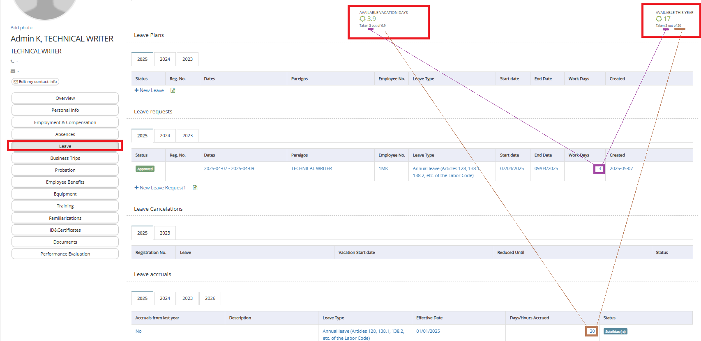
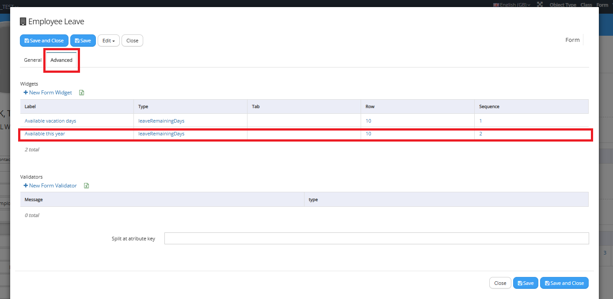
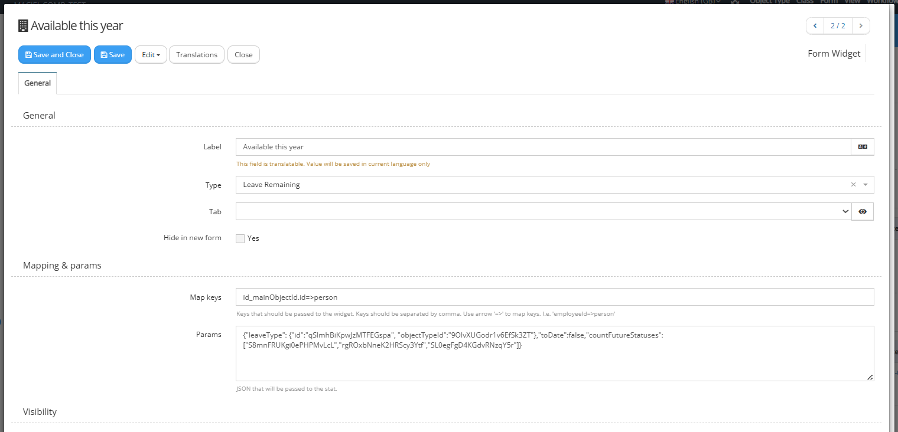
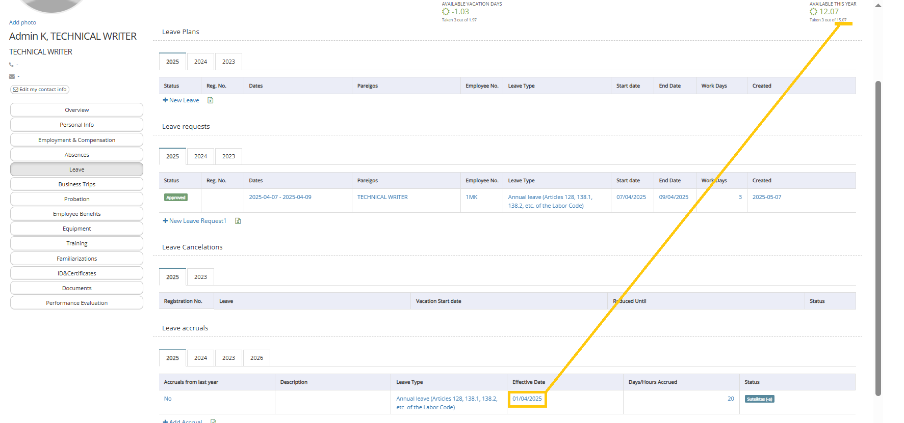
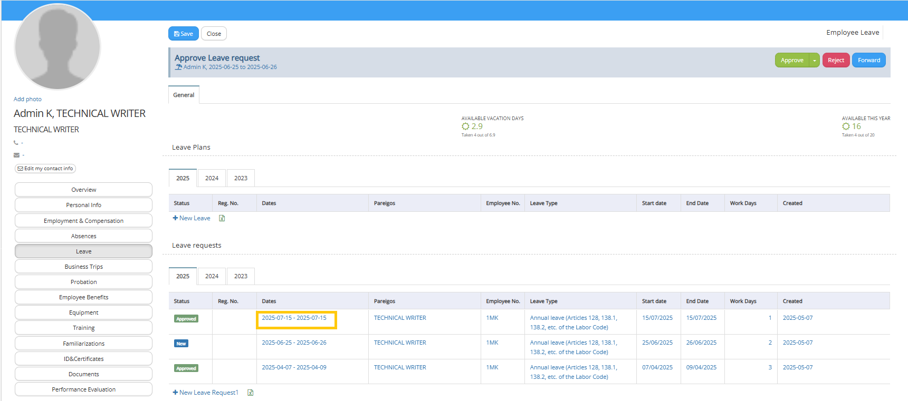
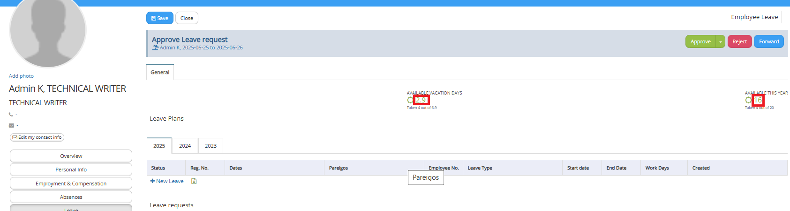

# Widgets

## Who Out

Map key example from Data Range Control:

```javascript
employee=>person,datesRange[0]=>dateFrom,datesRange[1]=>dateTo
```

## Planned Vacations Days

How to add footer text inside params with translations:

```json
{"footerText":"text without translation", "translations":{"lt-LT": {"footerText":"text translate lt"}, "en-GB": {"footerText":"text translate en"}}}
```

## Leave Remaining

This widget is buit-in, dedicated only for the form 'Employee Leave' of the class 'Employee Leave' of subobject 'Leave' of employee collection (of class 'Employee').

It typically appears after 'HR Core' and 'Absences' apps install in 'Leave' section of employee card:



It displays, depending on the setup (in above example both widgets are created with the same 'Leave Remaining' widget type), quantity of available vacation days for the employee in current year, for example: AVAILABLE THIS YEAR = 17. In bottom line it also displays ingredients of the calcucation for example 'Taken 3 out of 20'.

The most intuitive configuration is completed in the widget 'AVAILABLE THIS YEAR' (this one displayed on the right side one). If you open 'Employee Leave' form, then in 'Advanced' tab you will find this widget definition:



After opening:



In the 'Map keys' you should use the following code to pass id of the employee to person attribute in widget:

```json
id_mainObjectId.id=>person
```

In the Params the following code is in use:

```json
{"leaveType": {"id":"qSImhBiKpwJzMTFEGspa", "objectTypeId":"9OlvXUGodr1v6EfSk3ZT"},"toDate":false,"countFutureStatuses":["S8mnFRUKgi0ePHPMvLcL","rgROxbNneK2HRScy3Ytf","SL0egFgD4KGdvRNzqY5r"]}
```

9OlvXUGodr1v6EfSk3ZT - is the id of object type of 'Leave Type',
qSImhBiKpwJzMTFEGspa - is the id of leave type 'Annual leave (Articles 128, 138.1, 138.2, etc. of the Labor Code)'

By the setup of the 2 above we are appointing of what leave type:
-  accruals should be accounted to calculate the pule of available days (... of 20'),
-  leave requests should be accounted to calculate the consumption of the days (3 of ...).

toDate - in our example it is set to false, which means that for each accounted leave accrual (single for 20) system is not splitting accoundated days quantity from accrual proportioanlly to the current date in the year (full 20 is dislpayed as '... of 20'). In the left widget 'AVAILABLE VACATION DAYS' definition this is the only parameter which is different (set to true) than in right one. The screenshot is prepared on 7th of May 2025 - from accounted 20 it is taking 6.9 days as proportional part for already passed days in the calendar year from accrual effective date (for 7th of May passed 126 days from effective date 1st of January 2025; that is why 126 days/ 365 days * 20 days = 6.9 days).

countFutureStatuses - includes the collection of ids of the statuses of leave requests. By this sdefinition to the consumption part ('3 of ...') will be also (to addition to the past ones from current year) accounted the leave requests on the dates grater than current date, but only in the case they will be of one of the appointed statuses. 

HOW THE WIDGET COLLECTS THE DATA

1. THE PULE FROM

The final result is presented like:  '... of 20'  in bottom line of the widget
In our example it is 20 days.

But system sums up all employee leave accruals which 'Effective Date' is in current year. For every such employee leave accrual it takes into the account 'Effective Date'. If you would like to take the whole quatity of days assigned to the accrual you should appoint 1st of January of current year. Otherwise (but still in current year) system will split the quantity and would take only the remaining part proportionally in year. For example in the same example if I change effective date to for example 1st of April 2025, system automatically will calculate the pule from as 75% in days (3 of 4 quarters remaining in year) which is around 15 days from originally 20.



Presenting the Params of the widget 'Available vacation days' (the one on the left side):

```json
{"leaveType": {"id":"qSImhBiKpwJzMTFEGspa", "objectTypeId":"9OlvXUGodr1v6EfSk3ZT"},"toDate":true,"countFutureStatuses":["S8mnFRUKgi0ePHPMvLcL","rgROxbNneK2HRScy3Ytf","SL0egFgD4KGdvRNzqY5r"]}
```

After the change of Effective Date to the first of April 2025 in this left widget value from changed from 6.9 to 1.97. This is because 15.07 days was accounted for remainng 9 months (365 days - 90 days = 275 days). So per each remaining days is 15.07 / 275 = 0,0548 vacation day per calenday day. Because "toDate" is set to true, system is not displaying all 15.07 but only the proportional part accounted from effective day to current day. It means all days in april 2025  (30) and 6 days of May 2025. 36 days * 0,0548 = 1,97 days .

For easier further explanations, restoring Effective Date of leave accrual for 1st of january 2025.


2. CONSUMPTION OF THE DAYS

The past days (in comparison to current date) of the  employee leave requests of the satuses different than 'Cancelled' and different than 'Rejected' are taken to calculate consumption part as   

'Taken 3 out of ...'

In this example case we have 1 single request of Approved status for past 3 days. Please notice that past leave requests of statuses like : 'New', 'Pending' are also taken into the calcucation.

In order to account for also the leave requests for the future dates, you have to setup parameter "countFutureStatuses". In our example we have assigned such:
S8mnFRUKgi0ePHPMvLcL - Registered
rgROxbNneK2HRScy3Ytf - Approved
SL0egFgD4KGdvRNzqY5r - Waiting

I will record 2 new future (from 7th of May 2025) leave requests of different statuses:



The one for July (in orange) has been taken to the consumption as it has approved status. The one for June has not been taken as it's New status is not included in collection in "countFutureStatuses".

3. Presenting available holiday days balance



The main value presnted in widget is presented like the difference between the pule from and consumption of the days.


Available vacation days
2,9 = 6,9 - 4

and

Available this year
16 = 20 - 4